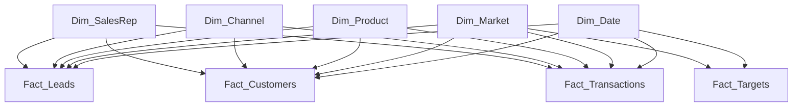

# 📈 Sales Funnel and Commercial Performance Dashboard(International Vehicle Payments) | Excel, Power BI & Business Analytics

<p align="center">
  
</p>

<p align="center">


</p>

---

#  Sales Performance Dashboard

## 📌 Project Overview

This project is an end-to-end **Sales Analytics and Business Intelligence case study** designed to analyse commercial performance across the complete sales funnel of a simulated international vehicle payments business.

The project combines **Excel, Power Query, data modelling, DAX, and Power BI** to transform raw lead, customer, sales representative, target, and transaction data into actionable commercial insights.

The analysis follows the customer journey from:

**Lead Generation → Qualification → Opportunity → Win → Activation → Transaction → Revenue → Retention / Churn**

The final Power BI dashboard provides management with a consolidated view of:

* Sales funnel performance
* Customer activation
* Revenue realisation
* Revenue target attainment
* Market performance
* Acquisition channel effectiveness
* Sales representative productivity
* Customer attrition

---

## 📊 Dashboard Preview

<p align="center">
  )
<p/>
---

## 🎯 Business Problem

High lead generation or customer acquisition does not necessarily translate into strong commercial performance.

A business may generate a large number of leads and sales wins while still experiencing:

* Low conversion rates
* Poor customer activation
* Weak transaction usage
* Revenue underperformance
* High customer attrition
* Uneven market performance
* Ineffective acquisition channels

The objective of this project was therefore to develop a reporting solution capable of answering important commercial questions such as:

* How effectively are leads progressing through the sales funnel?
* Where are potential customers dropping out?
* How many won customers successfully activate?
* Are activated customers generating expected revenue?
* Which markets generate the most revenue?
* Which acquisition channels convert most effectively?
* Which sales representatives generate the strongest commercial results?
* Are revenue targets being achieved?
* How significant is customer churn?

---

## 🎯 Project Objectives

The project was designed to:

1. Profile and validate raw sales, customer, and transaction data.
2. Identify and resolve data quality issues.
3. Standardise market, customer, and channel definitions.
4. Build a relational data model in Power BI.
5. Develop business measures using DAX.
6. Analyse sales funnel performance.
7. Measure customer activation and churn.
8. Evaluate acquisition channel effectiveness.
9. Compare realised revenue against revenue targets.
10. Analyse performance across markets and sales representatives.
11. Translate analytical findings into business recommendations.

---

# 📂 Dataset Structure

The project consists of five main analytical datasets.

## 1. Leads Dataset

Contains information about potential customers entering the sales funnel.

Key fields include:

* `Lead_ID`
* `Created_Date`
* `Market`
* `Product`
* `Channel`
* `Sales_Rep_ID`
* `Lead_Status`
* `Qualified_Date`
* `Opportunity_Date`
* `Won_Date`
* `Lost_Date`
* `Expected_Monthly_Revenue_EUR`

---

## 2. Customers Dataset

Contains customers generated from successfully won leads.

Key fields include:

* `Customer_ID`
* `Lead_ID`
* `Won_Date`
* `Activation_Date`
* `Market`
* `Product`
* `Channel`
* `Sales_Rep_ID`
* `Customer_Segment`
* `Customer_Status`
* `Churn_Date`
* `Expected_Monthly_Revenue_EUR`

---

## 3. Transactions Dataset

Contains transaction activity and realised revenue.

Key fields include:

* `Transaction_ID`
* `Customer_ID`
* `Transaction_Date`
* `Transaction_Type`
* `Gross_Value_EUR`
* `Revenue_EUR`
* `Transaction_Status`
* `Market`

---

## 4. Sales Representatives Dataset

Contains information about members of the sales team.

Key fields include:

* `Rep_ID`
* `Rep_Name`
* `Market`
* `Region`
* `Team`
* `Monthly_Target_EUR`

---

## 5. Sales Targets Dataset

Contains monthly commercial targets.

Key fields include:

* `Month`
* `Market`
* `Lead_Target`
* `Win_Rate_Target`
* `Activation_Rate_Target`
* `Revenue_Target_EUR`
* `Churn_Rate_Target`

---

# 🧹 Data Quality Assessment

Before developing the Power BI dashboard, the raw datasets were profiled and validated in Excel.

Several data quality problems were intentionally included in the simulated dataset.

## Leads Data Quality Issues

| Data Quality Issue                 | Records Affected |
| ---------------------------------- | ---------------: |
| Duplicate Lead IDs                 | 8 duplicated IDs |
| Missing acquisition channel        |               10 |
| Inconsistent market categories     |               12 |
| Invalid funnel date sequence       |                3 |
| Unmatched Sales Representative IDs |                6 |
| Non-numeric expected revenue       |                5 |

Examples included:

* `DE` and `Germany` representing the same market
* `UK` and `Great Britain` representing `United Kingdom`
* Revenue values stored as text
* Missing acquisition channels
* Invalid sales representative IDs
* Duplicate lead records
* Won dates occurring before opportunity dates

---

## Customer Data Quality Checks

Customer data was validated for:

* Duplicate Customer IDs
* Unmatched Lead IDs
* Activation dates occurring before Won dates
* Active customers without activation dates
* Churned customers without churn dates
* Inconsistent market categories
* Missing customer segments
* Unmatched Sales Representative IDs

---

## Transaction Data Quality Checks

Transaction records were validated for:

* Duplicate Transaction IDs
* Unmatched Customer IDs
* Transactions occurring before customer activation
* Cancelled transactions containing revenue
* Negative revenue values
* Non-numeric transaction values
* Inconsistent market categories
* Transactions occurring after customer churn

---

# 🧽 Data Cleaning

Data cleaning was performed using **Excel and Power Query**.

The main transformations included:

* Removing exact duplicate records
* Standardising market names
* Standardising acquisition channel values
* Converting text-based revenue fields to numeric values
* Handling missing categorical information
* Validating foreign-key relationships
* Correcting data types
* Identifying invalid date sequences
* Separating valid records from records requiring investigation
* Standardising customer and transaction status values

The original raw datasets were preserved to maintain traceability.

---

# 🧱 Power BI Data Model

The Power BI model follows a simplified **star-schema approach**.

## Fact Tables

* `Fact_Leads`
* `Fact_Customers`
* `Fact_Transactions`
* `Fact_Targets`

## Dimension Tables

* `Dim_Date`
* `Dim_Market`
* `Dim_Product`
* `Dim_Channel`
* `Dim_SalesRep`

---

## Data Model Diagram



---

# 📈 Key Performance Indicators

The dashboard tracks the major commercial KPIs across the complete sales funnel.

| KPI                       |                   Result |
| ------------------------- | -----------------------: |
| Total Leads               |                **1,000** |
| Qualification Rate        |                **70.2%** |
| Opportunity Rate          |                **53.1%** |
| Funnel Won Rate           |                **22.0%** |
| Win Rate                  |                **41.4%** |
| Activation Rate           |                **79.1%** |
| Activated Leads           | **17.4% of total leads** |
| Completed Revenue         |             **€509,011** |
| Customer Churn Rate       |                 **9.2%** |
| Revenue Target Attainment |                **70.9%** |

---

# 🔄 Sales Funnel Analysis

The sales funnel tracks customer progression across five major stages:

```text
Leads
  ↓
Qualified
  ↓
Opportunities
  ↓
Won
  ↓
Activated
```

The dashboard shows:

* **100%** of records begin as leads
* **70.2%** progress to qualification
* **53.1%** reach the opportunity stage
* **22.0%** of total leads are eventually won
* **17.4%** of initial leads become activated customers

This demonstrates substantial cumulative funnel leakage between initial lead generation and customer activation.

---

# 💰 Revenue Performance

Completed revenue generated from valid completed transactions was:

## **€509,011**

Revenue performance was also compared against the commercial revenue target.

### Revenue Target Attainment

## **70.9%**

Because this project uses synthetic data, revenue targets were calibrated to reflect the scale of the simulated transaction activity and to create a realistic commercial target-attainment scenario.

The final target scenario resulted in **70.9% revenue target attainment**, allowing the dashboard to demonstrate both actual performance and the remaining revenue gap.

---

# 🌍 Revenue by Market

Completed revenue was analysed across international markets.

Major contributors include:

| Market         | Approx. Completed Revenue |
| -------------- | ------------------------: |
| Germany        |                     €134K |
| France         |                     €122K |
| United Kingdom |                     €116K |
| Czech Republic |                      €73K |

Germany generated the highest completed revenue among the visible markets.

This analysis allows management to identify which markets are contributing most strongly to commercial performance.

---

# 📣 Acquisition Channel Analysis

Win rate was analysed by acquisition channel.

Channels include:

* Direct Sales
* Referral
* Partner
* Unknown

The analysis helps answer:

* Which channels generate the strongest conversion?
* Which channels produce lower-quality leads?
* Which acquisition sources require further investigation?

The `Unknown` channel showed unusually strong win-rate performance.

However, because `Unknown` represents leads with missing channel attribution, this category should be interpreted cautiously.

This demonstrates why **data quality must be considered when interpreting business performance**.

---

# 👥 Sales Representative Performance

Completed revenue was analysed by Sales Representative.

Top visible performers include:

1. Tom Jansen
2. Martin Hoff...
3. Clara Vos
4. Sophie Brown
5. Lukas Meyer

The analysis allows sales leadership to compare performance across representatives.

However, revenue alone should not be treated as a complete measure of salesperson productivity.

Additional factors should include:

* Lead volume
* Qualification rate
* Win rate
* Activation rate
* Revenue per customer
* Customer churn
* Market potential
* Product mix

---

# 📉 Customer Churn

The customer churn rate was:

## **9.2%**

Customer churn is important because commercial performance should not be measured only by customer acquisition.

A business can generate strong new sales while losing significant value through customer attrition.

Further churn analysis could therefore be performed by:

* Market
* Product
* Acquisition channel
* Customer segment
* Sales representative
* Customer tenure
* Revenue contribution

---

# 💡 Key Business Insights

## 1. Significant Funnel Leakage Exists

Only **17.4% of initial leads eventually become activated customers**.

This suggests that commercial growth may not depend only on generating more leads.

Improving conversion at existing funnel stages may provide significant additional value.

---

## 2. Customer Activation Is a Critical Commercial Stage

The activation rate is **79.1%**.

This indicates that not every won customer becomes commercially active.

Sales reporting should therefore monitor both:

* Won customers
* Activated customers

rather than treating a signed customer as the final commercial outcome.

---

## 3. Revenue Target Has Not Been Fully Achieved

The business achieved **70.9% of its revenue target**.

This leaves a meaningful performance gap.

The gap could potentially be associated with:

* Funnel conversion
* Activation delays
* Transaction frequency
* Revenue per customer
* Market performance
* Sales productivity
* Customer churn

---

## 4. Germany Is the Strongest Revenue Market

Germany generated approximately **€134K** in completed revenue.

France and the United Kingdom were also major contributors.

This suggests that market-level commercial decisions should consider both:

* Revenue size
* Funnel efficiency

before reallocating sales resources.

---

## 5. Sales Representative Performance Varies

There are visible differences in completed revenue across Sales Representatives.

However, these differences may be influenced by:

* Number of assigned leads
* Market potential
* Customer segments
* Product mix
* Sales conversion ability
* Customer activation
* Customer transaction behaviour

Further analysis would therefore be required before attributing performance differences entirely to the salesperson.

---

## 6. Missing Channel Information Can Distort Performance Analysis

The `Unknown` channel displays a high win rate.

However, this category originates from missing acquisition-channel data.

Commercial decisions should therefore not be based on this category without first improving source-system data quality.

---

# ✅ Business Recommendations

## 1. Investigate Funnel Leakage

Analyse conversion loss between:

* Lead → Qualified
* Qualified → Opportunity
* Opportunity → Won
* Won → Activated

Segment performance by:

* Market
* Product
* Channel
* Sales Representative
* Customer Segment

This can identify where the largest commercial losses occur.

---

## 2. Improve Customer Activation

Monitor:

* Won customers not yet activated
* Average days to activation
* Activation rate by market
* Activation rate by channel
* Activation rate by Sales Representative

Earlier intervention with non-activated customers may improve revenue realisation.

---

## 3. Investigate the Revenue Target Gap

Break the remaining revenue gap into:

* Customer acquisition gap
* Conversion gap
* Activation gap
* Transaction frequency gap
* Revenue-per-customer gap
* Churn impact

This provides a more actionable explanation than simply reporting target attainment.

---

## 4. Improve Acquisition Channel Data Quality

Reduce missing channel attribution by implementing:

* Mandatory CRM fields
* Standardised channel definitions
* Controlled category values
* Source-system validation

Reliable channel attribution is required for accurate channel-effectiveness analysis.

---

## 5. Measure Sales Productivity Beyond Revenue

Sales Representative performance should consider:

* Leads managed
* Qualification rate
* Opportunity conversion
* Win rate
* Activation rate
* Completed revenue
* Revenue per customer
* Customer churn

This creates a more balanced view of performance.

---

## 6. Strengthen Customer Retention Monitoring

With churn at **9.2%**, retention should remain part of recurring commercial reporting.

Customers should be analysed by:

* Revenue value
* Customer segment
* Market
* Product
* Channel
* Customer tenure

High-value customers showing declining transaction activity could be prioritised for retention actions.

---

# 🎛️ Dashboard Filters

The Power BI dashboard includes interactive slicers for:

* Month
* Market
* Product
* Acquisition Channel
* Sales Representative

These allow users to dynamically explore commercial performance from different perspectives.

---

# 📊 Dashboard Visualisations

The final dashboard includes:

### KPI Cards

* Total Leads
* Win Rate
* Activation Rate
* Completed Revenue
* Customer Churn Rate
* Revenue Target Attainment

### Funnel Chart

Displays progression across:

* Leads
* Qualified
* Opportunities
* Won
* Activated

### Line and Column Chart

**Completed Revenue per Month vs Revenue Target**

### Bar Chart

**Completed Revenue by Market**

### Bar Chart

**Win Rate by Acquisition Channel**

### Bar Chart

**Completed Revenue by Sales Representative**

---

# 🧮 Key DAX Measures

## Total Leads

```DAX
Total Leads =
DISTINCTCOUNT(Fact_Leads[Lead_ID])
```

---

## Won Leads

```DAX
Won Leads =
CALCULATE(
    DISTINCTCOUNT(Fact_Leads[Lead_ID]),
    NOT ISBLANK(Fact_Leads[Won_Date])
)
```

---

## Win Rate

```DAX
Win Rate =
DIVIDE(
    [Won Leads],
    [Opportunities]
)
```

---

## Activated Customers

```DAX
Activated Customers =
CALCULATE(
    DISTINCTCOUNT(Fact_Customers[Customer_ID]),
    NOT ISBLANK(Fact_Customers[Activation_Date])
)
```

---

## Activation Rate

```DAX
Activation Rate =
DIVIDE(
    [Activated Customers],
    [Won Customers]
)
```

---

## Completed Revenue

```DAX
Completed Revenue =
CALCULATE(
    SUM(Fact_Transactions[Revenue_EUR]),
    Fact_Transactions[Transaction_Status] = "Completed"
)
```

---

## Customer Churn Rate

```DAX
Customer Churn Rate =
DIVIDE(
    [Churned Customers],
    [Activated Customers]
)
```

---

## Revenue Target

```DAX
Revenue Target =
SUM(Fact_Targets[Revenue_Target_EUR])
```

---

## Revenue Target Attainment

```DAX
Revenue Target Attainment =
DIVIDE(
    [Completed Revenue],
    [Revenue Target]
)
```

---

# 🛠️ Tools & Technologies

| Technology            | Usage                                            |
| --------------------- | ------------------------------------------------ |
| Microsoft Excel       | Data profiling and validation                    |
| Power Query           | Data cleaning and transformation                 |
| Power BI              | Data modelling and dashboard development         |
| DAX                   | KPI and business metric calculations             |
| Excel Functions       | COUNTIF, COUNTBLANK, XLOOKUP, IF, UNIQUE, FILTER |
| Dimensional Modelling | Fact and dimension table design                  |

---

# 🧠 Skills Demonstrated

This project demonstrates practical experience in:

* Sales Analytics
* Sales Funnel Analysis
* Commercial Performance Analysis
* Customer Activation Analysis
* Customer Churn Analysis
* Revenue Analysis
* Revenue Target Analysis
* Channel Effectiveness
* Sales Team Performance
* KPI Development
* Data Quality Assessment
* Data Cleaning
* Data Validation
* Power Query
* Power BI
* DAX
* Dimensional Data Modelling
* Dashboard Design
* Root Cause Analysis
* Business Intelligence
* Business Insight Communication

---

# 🔄 Project Workflow

```text
Raw Sales Data
        ↓
Data Profiling
        ↓
Data Quality Assessment
        ↓
Data Cleaning
        ↓
Data Standardisation
        ↓
Power Query Transformation
        ↓
Dimensional Data Model
        ↓
DAX KPI Development
        ↓
Sales Funnel Analysis
        ↓
Commercial Performance Dashboard
        ↓
Business Insights
        ↓
Recommendations
```

---

# 📁 Repository Structure

```text
Sales-Funnel-Commercial-Performance-Analytics/
│
├── data/
│   └── Sales_Analytics_Data.xlsx
│
├── dashboard/
│   └── Sales_Performance_Dashboard.pbix
│
├── images/
│   └── Sales_Performance_Dashboard.png
│
├── docs/
│   └── Data_Quality_Assessment.xlsx
│
└── README.md
```

---

# 🚀 Potential Future Enhancements

Future improvements could include:

* Cohort-based activation analysis
* Revenue churn analysis
* Customer Lifetime Value
* Pipeline coverage analysis
* Sales cycle duration
* Revenue per acquisition channel
* Revenue per Sales Representative
* Target attainment by market
* Customer retention cohorts
* Market drill-through pages
* Sales Representative drill-through pages
* SQL-based data preparation
* Automated Power BI refresh
* Predictive customer churn modelling
* Revenue forecasting
* Customer segmentation modelling

---

# ⚠️ Project Disclaimer

This project uses **synthetic data** and was developed solely for:

* Learning
* Portfolio development
* Sales Analytics practice
* Business Intelligence demonstration

It does not contain confidential company information and does not represent the actual performance of any organisation.

Commercial targets and assumptions were calibrated specifically for the simulated business scenario.

---

# 👤 Author

**Bulus Umoru**
Data Analyst | BI Analyst

* [LinkedIn](https://www.linkedin.com/in/bulus-umoru/)
* [Portfolio](https://umorubulus.github.io/Portfolio/)
* [GitHub](https://github.com/umorubulus)

---

## ⭐ Feedback

Feedback and suggestions around **Sales Analytics, Power BI, Business Intelligence, data modelling, and commercial performance reporting** are welcome.

If you find this project useful, feel free to ⭐ the repository.
